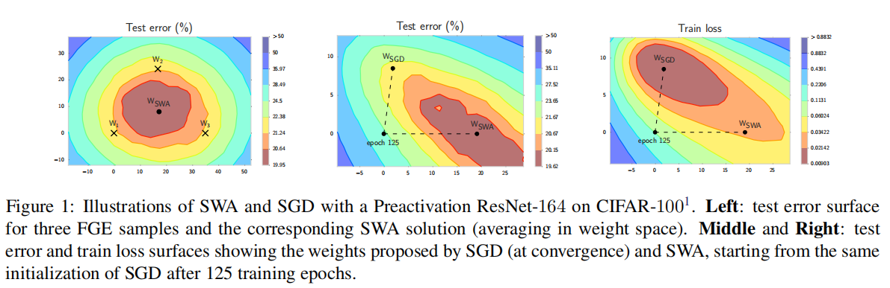
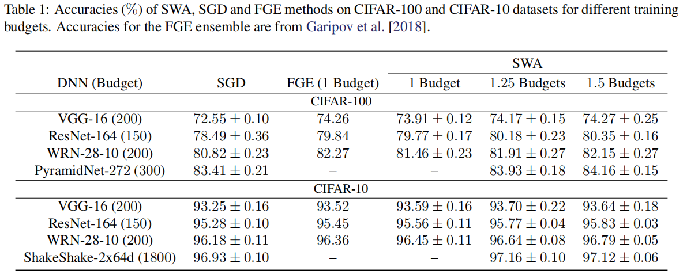

## Stochastic Weight Averaging (SWA) - Paddle Version  

This repoitory contains a **Paddle** implementation of the Stochastic Weight Averaging(SWA) training method.

* Original Paper: [Averaging Weights Leads to Wider Optima and Better Generalization](https://arxiv.org/abs/1803.05407)

by Pavel Izmailov, Dmitrii Podoprikhin, Timur Garipov, Dmitry Vetrov and Andrew Gordon Wilson.

* Original Pytorch Implementation: [https://github.com/timgaripov/swa](https://github.com/timgaripov/swa)

## Introduction  

Deep neural networks are typically trained by optimizing a loss function with an SGD variant, 
in conjunction with a decaying learning rate, until convergence. but simple averaging of 
multiple points along the trajectory of SGD, with a cyclical or constant learning rate, leads 
to better generalization than conventional training which called Stochastic Weight Averaging (SWA) 
procedure.


SWA is extremely easy to implement, improves generalization,and has almost no computational overhead.The experimental results in the paper is summarized in the following. 


We implement the SWA method with [Paddle](https://github.com/PaddlePaddle/Paddle) and test with VGG16 model. The results  are close to the orginal paper on the CIFAR-10 datasets. 


## Structure  
```
swa-paddle
     ├──  models 
        ├── vgg.py
        ├── preresnet.py
        ├── wide_resnet.py
     ├── eval.py 
     ├── train.py 
     ├── utils.py 
```

## Training:
```python
!python train.py --swa  
```
## Evaluating:
```python 
!python eval.py --model_path="out/checkpoint.pdparams" 
```

## Results:  

| Method  |DataSet| Environment | Model| Epoch| Test Accuracy|   
| --- | --- |--- | --- |---|---|  
| SWA| CIFAR-10| Tesla V100 | VGG-16 | 200 | 93.68 |  

## AI studio:
* AI studio link : [https://aistudio.baidu.com/aistudio/projectdetail/2528609](https://aistudio.baidu.com/aistudio/projectdetail/2528609) 
* if you want to train this model using script， you can click to following link [https://aistudio.baidu.com/aistudio/clusterprojectdetail/2504009](https://aistudio.baidu.com/aistudio/clusterprojectdetail/2504009) 
To run this script:
```python
!python -m paddle.distributed.launch train.py --swa
```
## Model:  
The model we have trained is save to : [Baidu Aistudio SWA Paddle](https://aistudio.baidu.com/aistudio/projectdetail/2564622)  
